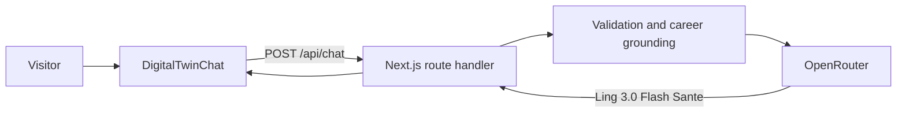

# Muhammad Fahad Khan - Executive Portfolio

A responsive personal portfolio for Muhammad Fahad Khan, built with Next.js and TypeScript. The visual direction combines an editorial, high-contrast identity with Apple-inspired glass surfaces, spring-like micro-interactions, pointer-aware lighting, and restrained motion.

The site also includes an AI career twin that answers questions using verified résumé information through OpenRouter.

## Features

- Professional introduction, skills, operating principles, and career timeline
- Downloadable résumé
- Future-facing project and case-study placeholders
- Résumé-grounded AI career twin
- Suggested chat questions and multi-turn conversation history
- Floating glass navigation with active-section feedback
- Scroll progress and section-reveal animations
- Pointer-responsive lighting and subtle three-dimensional card movement
- Responsive desktop and mobile layouts
- Keyboard focus styles and reduced-motion support
- Server-side API key handling, request validation, timeouts, and basic rate limiting

## Technology

| Area | Technology |
| --- | --- |
| Framework | Next.js 16 App Router |
| UI | React 19 and TypeScript |
| Styling | Global responsive CSS |
| Icons | Lucide React |
| Fonts | Manrope Variable and Space Grotesk Variable |
| AI provider | OpenRouter |
| AI model | `inclusionai/ling-3.0-flash-sante:free` |

The exact installed versions are recorded in `package-lock.json`.

## Requirements

- Node.js 20.9 or newer
- npm
- An OpenRouter API key for the AI career twin

## Local setup

1. Clone or download the project.
2. Install the locked dependencies:

   ```bash
   npm ci
   ```

3. Create or update `.env` in the project root:

   ```dotenv
   OPEN_ROUTER_API_KEY=your_openrouter_api_key
   ```

4. Start the development server:

   ```bash
   npm run dev
   ```

5. Open [http://localhost:3000](http://localhost:3000).

The API key must remain server-side. Do not rename it with a `NEXT_PUBLIC_` prefix or commit the `.env` file.

## Available commands

| Command | Purpose |
| --- | --- |
| `npm run dev` | Start the local development server |
| `npm run build` | Create an optimized production build |
| `npm run start` | Serve the completed production build |
| `npm run lint` | Run ESLint across the project |

To test the production build locally:

```bash
npm run build
npm run start
```

## Project structure

```text
.
├── app/
│   ├── api/chat/route.ts       # Server-side OpenRouter integration
│   ├── globals.css             # Design system, layout, and interactions
│   ├── layout.tsx              # Root layout, fonts, and metadata
│   └── page.tsx                # Portfolio page and career content
├── components/
│   └── DigitalTwinChat.tsx     # Interactive AI chat interface
├── public/
│   └── resume.pdf              # Publicly downloadable résumé
├── Profile.pdf                 # Source profile document
├── eslint.config.mjs
├── package.json
├── package-lock.json
└── tsconfig.json
```

Generated directories such as `.next/` and `node_modules/` are intentionally excluded from source control.

## AI career twin

The browser sends a bounded chat history to `POST /api/chat`. The server validates the request, adds the verified career context and behavioral rules, and then calls OpenRouter. The API key never enters the client-side JavaScript bundle.



### API request

```json
{
  "messages": [
    {
      "role": "user",
      "content": "What is Fahad's current role?"
    }
  ]
}
```

### API response

```json
{
  "message": "Fahad is currently a Senior Software Engineer at Nisum."
}
```

The route accepts up to eight messages per request and limits each message to 500 characters. It also applies a 30-second upstream timeout and an in-memory limit of ten requests per minute for each detected client address.

The in-memory limiter is appropriate for local use and a single long-running process. A production deployment with multiple instances should replace it with a shared rate-limit store.

## Updating portfolio content

### Career information

Update the visible page content in `app/page.tsx`. Career details used by the AI twin are maintained separately in `app/api/chat/route.ts`; keep both sources synchronized.

### Résumé

1. Replace `Profile.pdf` with the latest source document if the source is retained in the repository.
2. Copy the public version to `public/resume.pdf`.
3. Update the visible career content and the AI career context.
4. Run the verification commands before publishing.

### Contact links

Email and LinkedIn links are currently defined in `app/page.tsx`. Update every occurrence when contact information changes.

### AI model

The OpenRouter model is defined by the `MODEL` constant in `app/api/chat/route.ts`. Confirm that a replacement model supports standard chat completions before changing it.

## Design and accessibility

The interface includes:

- Semantic navigation, sections, headings, forms, and buttons
- Accessible chat status and error announcements
- Visible keyboard focus indicators
- `prefers-reduced-motion` fallbacks
- Touch-device fallbacks that disable pointer-specific depth effects
- Responsive navigation and layouts below 800 pixels

Animations are implemented with CSS and small browser event handlers rather than a separate animation framework.

## Verification

Run both checks before committing or deploying:

```bash
npm run lint
npm run build
```

A successful build should include these routes:

```text
/           Static portfolio page
/api/chat   Dynamic server-side chat endpoint
```

Optional local API test:

```bash
curl -X POST http://localhost:3000/api/chat \
  -H 'Content-Type: application/json' \
  --data '{"messages":[{"role":"user","content":"What is Fahad current role?"}]}'
```

This request uses the configured OpenRouter account and may count toward its usage limits.

## Deployment

Deploy to a platform that supports the Next.js App Router and server-side route handlers. The AI feature requires a server runtime; a static-only export is not sufficient.

Before deployment:

1. Add `OPEN_ROUTER_API_KEY` to the hosting platform's secret or environment-variable settings.
2. Do not expose the key through a public environment variable.
3. Run `npm run lint` and `npm run build`.
4. Verify the homepage, résumé download, responsive layout, and `/api/chat` endpoint in the deployed environment.
5. Configure a shared rate limiter if the deployment can run more than one application instance.

## Troubleshooting

### The chat says it is not configured

Confirm that `.env` exists in the project root, contains `OPEN_ROUTER_API_KEY`, and that the development server was restarted after the variable was added.

### The chat cannot answer

- Confirm that the OpenRouter key is active.
- Confirm that the configured model is still available to the account.
- Review the server terminal for the upstream status or timeout message.
- Verify that the machine or hosting platform can reach `https://openrouter.ai`.

### Port 3000 is already in use

Next.js may select another available port automatically. Use the local URL printed in the terminal, or stop the existing development server before restarting.

### Content and AI answers disagree

The visible portfolio and the AI grounding are intentionally explicit and stored separately. Update both `app/page.tsx` and `app/api/chat/route.ts`, then rebuild.

## Security notes

- `.env` is ignored by Git and must not be committed.
- The OpenRouter key is read only inside the server route.
- User input is validated and trimmed before it is sent upstream.
- The system prompt instructs the model not to reveal secrets or invent career claims.
- Application logs include upstream error messages but not the API key.
- Model output should still be treated as AI-generated and may occasionally be imperfect.

## License

No license file is currently included. Add one before distributing or accepting external contributions.
